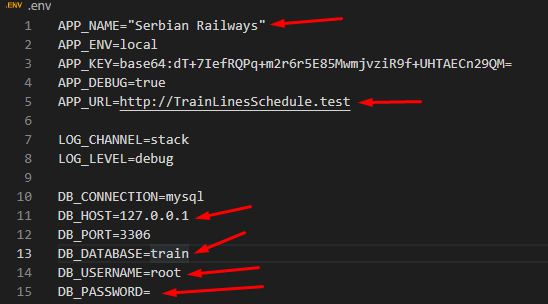

## Pre Requirements

1. Up-to-date COMPOSER
2. PHP 8+
3. Laravel 8+
4. Up-to-date packagist
5. Node.js
6. XAMPP/WAMPP for WINDOWS

## Installation of this exact project 

1. Step: Download project 
2. Step: Run your bash inside the downloaded folder and type: composer install (it will install all the files that you are missing from the original file) - If there is any error, run composer update
3. Step: Import train.sql to your SQL server
4. Step: Open your project in any editor that supports this technology and search for .env file
5. Step: Go to bash and type: php artisan key:generate
6. Step: Search for these lines of code and setup database name to train and set up your ip addresses

-AFTER THIS , RESTART YOUR SQL SERVER! (GENERALLY AFTER EVERY CHANGE IN .ENV YOU SHOULD RESTART ALL THE ACTIVE SERVERS!)

7. Step: Go to bash again and type: npm install
8. Step: Go to bash again and type: npm run dev (this will push bootstrap files to public folder, so the user can actually see design)
9. Step: You are ready to go! Go to bash and type: php artisan serve (this will run your project, then go to broswer and type in your localhost address as the url)

                                 --- NOTE ---
 While typing these commands you always need to be in the project folder with your bash!!!!!

10. STEP: THANK YOU FOR BEING HERE! IT MEANS A LOT! :)