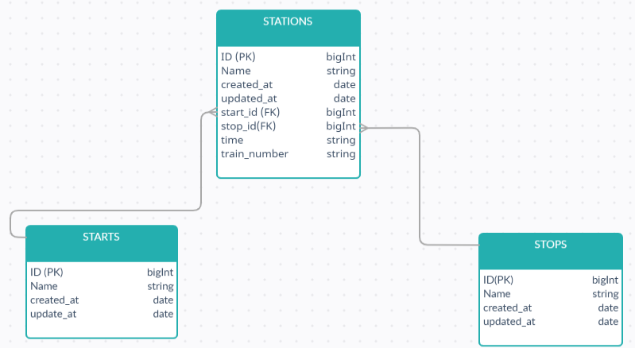

## Introduction

--- IF YOU WANT TO SKIP THIS PART GO TO THE INSTALL.md (all explained) file ---

Before we even begin, I want to thank you for being here and paying attention to my work!
In this chapter we are going to talk about the final product that you get. In the comming parts we'll discuss the logic and database of the project, then we'll see the CODE.

So, let's see the view of the user (Full responsive!!!):

1. When you enter, the first thing that you see looks like this:
-I have added some body height so you can scroll and move the form and see this beautiful picture.

2. Search part (You can select or type the station name):

3. Finally, all together:

Login and Register pages are there just in case of further development (booking tickets, creating new lines etc.)!
## Get to know the project

First thing when you start a project is to think how will you do it. For the front-end we used bootstrap 4 and JQUERY with its libraries. For the back-end we used PHP framework Laravel 8, and SQL, so eveything is OOP.  Here goes my thinking:

-Let's create a database were we will store our lines and connect it properly.
Database Schema:

So, the stations entity represents our lines. Every line has one Start and Stop station, while Start and Stop stations can have many lines.

-Secondly, we created our project and installed it with bootstrap 4 UI and Laravel Auth! All of this have been done with COMPOSER. We also ran "npm run dev" so we can push our bootstrap files to the public folder.

-Next step was to create a database on our localhost and connect it within laravel .env file.
-Next step: Create migrations with its models with "php artisan" (App\Http\Models) (database\migrations). Migration stands for a table in database. Model is how we talk with database from back-end. When we have created it successfully, we had to ran "php artisan migrate" and that is how we sent our tables to the database.

-At the resource\views\layouts we already had our app.blade.php with premade header and auth. We have created index.blade.php and footer.blade.php. All we had to do now was to extend footer.blade.php and app.blade.php in our new view index.blade.php. 

-Now we were ready to make a controller that will manage our functions and send it through the routes to our index.blade.php (php artisan make:controller StationsController).

## CODE CHAPTER

-There are 3 main files that we used for this project:

1.Index.blade.php (resources\views\index.blade.php)

-User view and JQUERY AJAX functions

2.StationsController (App\Htpp\Controllers\StationsController.php)

-All our back-end functions are stored here

3.Web.php (routes\web.php)

-All our routes are stored here

I have been commenting the code, so you can visit them and see what we have done. 

NOTE: IF YOU WANT THIS PROJECT TO WORK ON YOUR OWN PC VISIT INSTALL.md!!!
